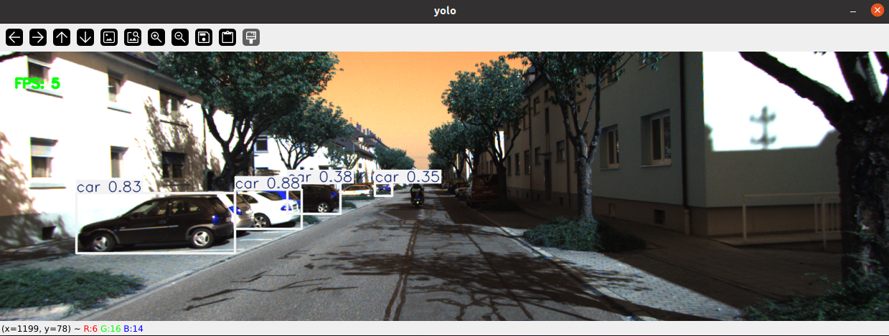

# yolo_ros

Provides a ROS package based on PyTorch-YOLO.

## Running Environment:

- Ubuntu 20.04
- ROS Noetic
- Python >= 3.7.0, PyTorch >= 1.7

## Environment Configuration:

1. First, install the environment with the corresponding Python and PyTorch versions.

2. Then install the following dependencies:

   ```
   pip install ultralytics
   pip install rospkg
   ```

3. Install Yolo_ROS:

   ```
   cd catkin_ws/src
   git clone https://github.com/HT-hlf/yolo_ros.git
   cd ..
   catkin_make
   ```

## Usage

## Use YOLO to Detect Objects in Images

#### Use in Simulation Environment

- Start the simulation environment and robot:

  ```
  source devel/setup.bash
  roslaunch turtlebot3_gazebo turtlebot3_empty_world.launch
  ```

- Start the ros_yolo node:

  ```
  source devel/setup.bash
  roslaunch yolo_ros yolo.launch
  ```


- 

  

#### Use with Recorded Dataset

- Play bag data:

  ```
  rosbag play kitti.bag -r 0.2
  ```

- Start the ros_yolo node:

  ```
  source devel/setup.bash
  roslaunch yolo_ros yolo_kitti.launch
  ```

  

  

## Use YOLO to Detect Objects in Images and Calculate Their 3D Coordinates

- Start the simulation environment and robot:

  ```
  source devel/setup.bash
  roslaunch turtlebot3_gazebo turtlebot3_empty_world.launch
  ```

- Start the ros_yolo3D node:

  ```
  source devel/setup.bash
  roslaunch yolo_ros yolo_3D.launch
  ```

  ​	

  

  