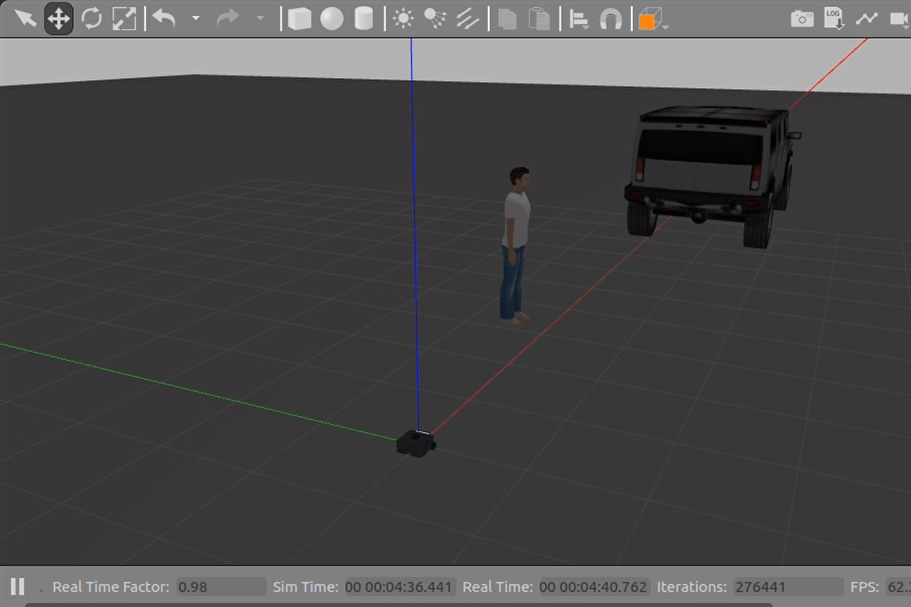
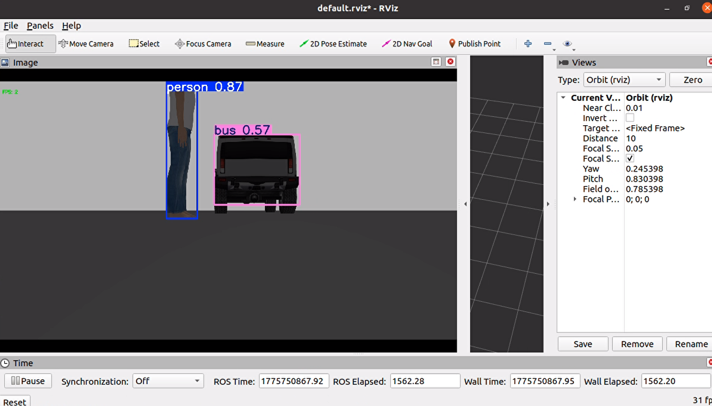
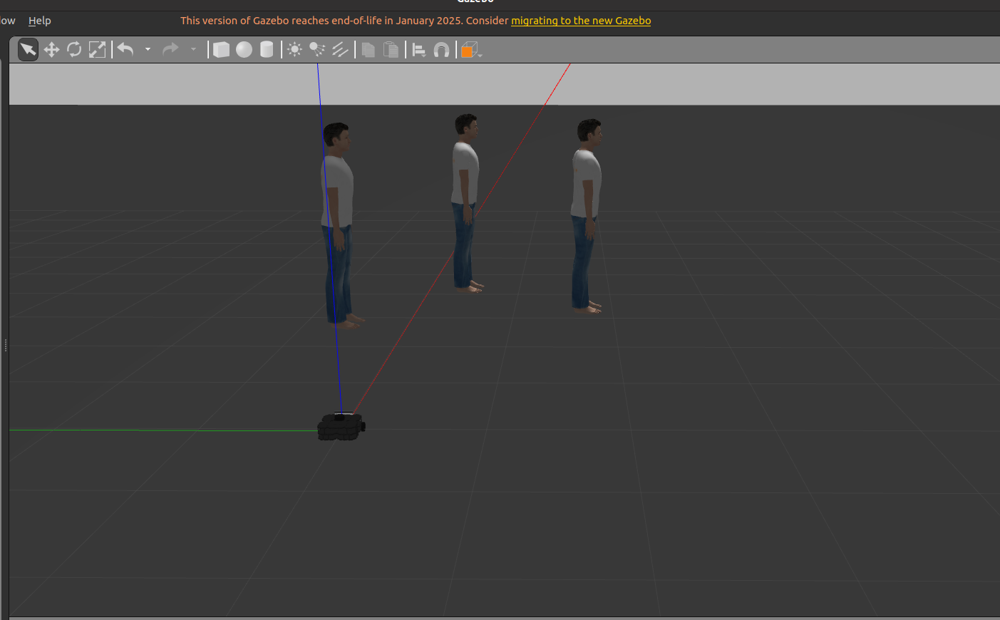

# yolo_ros

提供了一个基于PyTorch-YOLO的[PyTorch-YOLO](https://github.com/ultralytics/ultralytics)的ROS功能包

# 运行环境：
- 20.04
- ROS Noetic
- Python>=3.7.0环境，PyTorch>=1.7

# 环境配置：

## 1. 先安装符合对应的python和pytorch版本的环境

## 2. 然后安装以下依赖。

```
pip install ultralytics
pip install rospkg
```


## 3. 安装Yolo_ROS

```
cd catkin_ws/src
git clone https://github.com/HT-hlf/yolo_ros.git
cd ..
catkin_make
```

# 使用

## 使用YOLO检测图像中物体

### 仿真环境中使用

- 启动仿真环境和机器人

  ```
  source devel/setup.bash
  roslaunch turtlebot3_gazebo turtlebot3_empty_world.launch
  ```

- 启动ros_yolo节点

  ```
  source devel/setup.bash
  roslaunch yolo_ros yolo.launch
  ```



​							

### 录制数据集中使用

- 播放bag数据

  ```
  rosbag play kitti.bag -r 0.2
  ```

- 启动ros_yolo节点

  ```
  source devel/setup.bash 
  roslaunch yolo_ros yolo_kitti.launch
  ```

  
  
  

## 使用YOLO检测图像中物体并计算其三维坐标

- 启动仿真环境和机器人

  ```
  source devel/setup.bash
  roslaunch turtlebot3_gazebo turtlebot3_empty_world.launch
  ```

- 启动ros_yolo3D节点

  ```
  source devel/setup.bash
  roslaunch yolo_ros yolo_3D.launch
  ```

  ​	

  

  